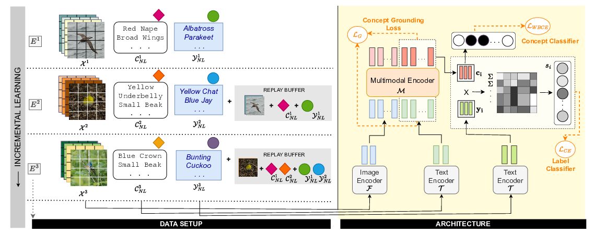
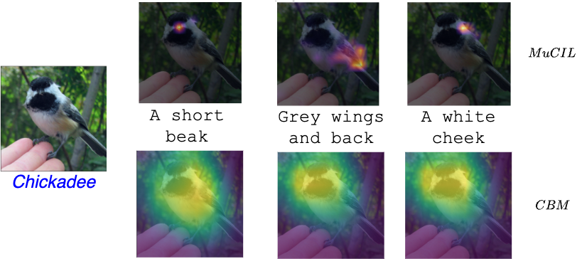

# Walking the Web of Concept-Class Relationships in Incrementally Trained Interpretable Models  [ **[](https://dummy-link.com) | [](https://dummy-link.com) | [](https://dummy-link.com)** ]


## Abstract

Concept-based methods have emerged as a promising direction to develop interpretable neural networks in standard supervised settings. However, most works that study them in incremental settings assume either a static concept set across all experiences or that each experience relies on a distinct set of concepts. In this work, we study concept-based models in a more realistic, dynamic setting where new classes may rely on older concepts while introducing new ones. We propose **MuCIL**, a novel multimodal concept-based incremental learner that preserves and augments the web of concept-class relationships over multiple experiences. Our approach achieves state-of-the-art classification performance while maintaining interpretability, outperforming existing concept-based models by over **2×** in some cases. We introduce new evaluation metrics and provide extensive experiments demonstrating the effectiveness of our approach.

---

## Architecture Overview

<p align="center">
  
</p>

Our architecture incrementally learns new classes and concepts while preserving existing relationships. It leverages pre-trained vision and language encoders to create multimodal concept embeddings, which are aligned to interpretable concept anchors for classification and interpretability.

---

## Qualitative Results: Concept Localization and Interventions

<p align="center">
  
  &nbsp;&nbsp;&nbsp;&nbsp;
  
</p>


**Figure (Left):** Our model effectively localizes concepts in input images, providing fine-grained visual explanations. The attention maps highlight regions corresponding to specific concepts, ensuring interpretability.  

**Figure (Right):** Concept interventions demonstrate the model’s ability to correct predictions by modifying learned concept activations. By updating certain concept labels, misclassified samples can be correctly identified, reinforcing the interpretability of our approach.


### **📊 Quantitative Results on Concept-Based Continual Learning (DER++ Method)**

The table below presents the **Final Average Accuracy (FAA) and Average Forgetting (AF)** scores for **DER++ continual learning method** across different datasets.

| Method                | CIFAR-100 (FAA) | CIFAR-100 (AF) | CUB (FAA) | CUB (AF) | ImageNet-100 (FAA) | ImageNet-100 (AF) |
|-----------------------|----------------|----------------|-----------|----------|---------------------|---------------------|
| **CBM-J (2020)**      | 0.22           | 0.76           | 0.38      | 0.40     | 0.27                | 0.64                |
| **ICIAP-J (2022)**    | 0.22           | 0.76           | 0.38      | 0.40     | 0.28                | 0.63                |
| **Label-Free (2023)** | 0.22           | 0.34           | 0.31      | 0.38     | 0.07                | 0.31                |
| **LaBo (2023)**       | 0.30           | 0.76           | 0.29      | 0.57     | 0.41                | 0.53                |
| **MuCIL (Ours)**      | **0.68**       | **0.33**       | **0.81**  | **0.07** | **0.81**            | **0.08**            |

📌 **FAA (Final Average Accuracy)**: Higher is better (measures retained performance).  
📌 **AF (Average Forgetting)**: Lower is better (measures memory retention).  

These results demonstrate that our model **MuCIL** significantly outperforms existing concept-based continual learning approaches under the **DER++ method**, achieving higher classification accuracy (FAA) and lower forgetting (AF). This highlights the ability of our approach to preserve concept-class relationships while achieving state-of-the-art performance.

---

## Quick Start

This section provides step-by-step instructions to set up the required datasets.

### 1. Dataset Setup

To get started, download and organize the datasets in the correct folder structure.

#### **📂 General Dataset Directory Structure**
All datasets should be placed inside a `datasets/` directory:

Ensure that the folder structure is as follows:

```bash
datasets/
├── CIFAR100/
│   ├── cifar-100-python/
│       ├── meta
│       ├── train
│       ├── test
│       ├── file.txt
│       ├── batches.meta
│       ├── data_batch_1
│       ├── data_batch_2
│       ├── data_batch_3
│       ├── data_batch_4
│       ├── data_batch_5
│       ├── test_batch
│       ├── readme.html
│
├── CUB/
│   ├── CUB_200_2011/
│       ├── images/
│       ├── attributes.txt
│       ├── image_class_labels.txt
│       ├── train_test_split.txt
│       ├── classes.txt
│       ├── bounding_boxes.txt
│       ├── parts/
│       ├── README.txt
│
├── ImageNet100/
│   ├── train/
│       ├── class_001/
│       ├── class_002/
│       ├── ...
│       ├── class_100/
│   ├── val/
│       ├── class_001/
│       ├── class_002/
│       ├── ...
│       ├── class_100/
│   ├── labels.txt
│   ├── README.txt
```

##### **📌 CIFAR-100 Setup**
The dataset can be downloaded from the [official website](https://www.cs.toronto.edu/~kriz/cifar.html) or using `torchvision`.

**Manual Download:**
   ```bash
   mkdir -p datasets/CIFAR100
   cd datasets/CIFAR100
   wget https://www.cs.toronto.edu/~kriz/cifar-100-python.tar.gz
   tar -xvzf cifar-100-python.tar.gz
   rm cifar-100-python.tar.gz
   cd ../../
   ```

**Alternative: Download via `torchvision` in Python**  
   If you prefer to use `torchvision`, you can download CIFAR-100 directly using the following Python script:

   ```python
   from torchvision import datasets
   dataset = datasets.CIFAR100(root="datasets/", download=True)
   ```

##### **📌 CUB-200-2011 Setup**
The CUB-200-2011 dataset can be downloaded from the [Caltech Vision Dataset](http://www.vision.caltech.edu/visipedia-data/CUB-200-2011/).

**Manual Download:**
   ```bash
   mkdir -p datasets/CUB
   cd datasets/CUB
   wget http://www.vision.caltech.edu/visipedia-data/CUB-200-2011/CUB_200_2011.tgz
   tar -xvzf CUB_200_2011.tgz
   rm CUB_200_2011.tgz
   cd ../../
   ```

##### **📌 ImageNet-100 Setup**
ImageNet-100 is a **subset** of ImageNet, often curated manually from ImageNet-1K. Ensure you have the dataset structured properly before proceeding.

**Manual Setup:**
Create the dataset directory:
   ```bash
   mkdir -p datasets/ImageNet100/train datasets/ImageNet100/val
   ```

**Alternative: Load ImageNet-100 using `torchvision` If you prefer to load ImageNet-100 using torchvision, use:** 
  ```python
   from torchvision import datasets
   dataset = datasets.ImageFolder(root="datasets/ImageNet100")
   ```


### 2. Models

This project supports multiple **image** and **language** encoders for processing multimodal data.

#### **📌 Image Encoders**
We use **ViT, CLIP, and FLAVA** as image encoders.  

1. **Vision Transformer (ViT)**
   - A transformer-based image encoder introduced by Google.
   - Pretrained on **ImageNet**.
   - Official repository: [ViT on Hugging Face](https://huggingface.co/google/vit-base-patch16-224)
   - **Load ViT in PyTorch:**
     ```python
     from transformers import ViTModel
     model = ViTModel.from_pretrained("google/vit-base-patch16-224")
     ```

2. **CLIP (Contrastive Language-Image Pretraining)**
   - A multimodal model by OpenAI trained on **web-scale image-text pairs**.
   - Supports **zero-shot learning**.
   - Official repository: [CLIP on OpenAI](https://github.com/openai/CLIP)
   - **Load CLIP in PyTorch:**
     ```python
     import torch
     import clip
     model, preprocess = clip.load("ViT-B/32", device="cuda" if torch.cuda.is_available() else "cpu")
     ```

3. **FLAVA (A Foundational Language and Vision Alignment Model)**
   - Developed by Meta AI for **vision-language tasks**.
   - Combines **image** and **language** processing in one model.
   - Official repository: [FLAVA on Hugging Face](https://huggingface.co/facebook/flava-full)
   - **Load FLAVA Image Encoder:**
     ```python
     from transformers import FlavaModel
     model = FlavaModel.from_pretrained("facebook/flava-full")
     ```

#### **📌 Language Encoders**
For text processing, we use **FLAVA, BERT, and CLIP**.

1. **FLAVA (Multimodal Encoder)**
   - Processes **both text and images**.
   - Pretrained on **vision-language datasets**.
   - **Load FLAVA's language encoder:**
     ```python
     from transformers import FlavaModel
     model = FlavaModel.from_pretrained("facebook/flava-full")
     text_encoder = model.text_model
     ```

2. **BERT (Bidirectional Encoder Representations from Transformers)**
   - One of the most widely used **language models**.
   - Pretrained on **Wikipedia and BooksCorpus**.
   - Official repository: [BERT on Hugging Face](https://huggingface.co/bert-base-uncased)
   - **Load BERT in PyTorch:**
     ```python
     from transformers import BertModel
     model = BertModel.from_pretrained("bert-base-uncased")
     ```

3. **CLIP (Text Encoder)**
   - Uses **contrastive learning** to align text with images.
   - **Load CLIP's text encoder:**
     ```python
     import clip
     import torch
     model, preprocess = clip.load("ViT-B/32", device="cuda" if torch.cuda.is_available() else "cpu")
     text_encoder = model.encode_text
     ```

Once the models are downloaded and loaded correctly, you can proceed with training and evaluation! 🚀

---

## Citation

If you find this work useful, please consider citing:

```bibtex
@inproceedings{
susmit2024walking,
title={Walking the Web of Concept-Class Relationships in Incrementally Trained Interpretable Models},
author={Susmit Agrawal, Deepika Vemuri, Sri Siddarth Chakaravarthy, Vineeth N Balasubramanian},
booktitle={The 39th Annual AAAI Conference on Artificial Intelligence (AAAI 2025)},
year={2025},
url={https://openreview.net/forum?id=fM4NW3f37c}
}
