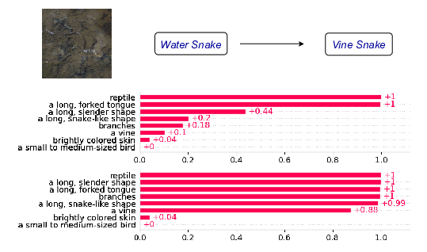

# Walking the Web of Concept-Class Relationships in Incrementally Trained Interpretable Models  [ **[](https://dummy-link.com) | [](https://dummy-link.com) | [](https://dummy-link.com)** ]


## Abstract

Concept-based methods have emerged as a promising direction to develop interpretable neural networks in standard supervised settings. However, most works that study them in incremental settings assume either a static concept set across all experiences or that each experience relies on a distinct set of concepts. In this work, we study concept-based models in a more realistic, dynamic setting where new classes may rely on older concepts while introducing new ones. We propose **MuCIL**, a novel multimodal concept-based incremental learner that preserves and augments the web of concept-class relationships over multiple experiences. Our approach achieves state-of-the-art classification performance while maintaining interpretability, outperforming existing concept-based models by over **2×** in some cases. We introduce new evaluation metrics and provide extensive experiments demonstrating the effectiveness of our approach.

---

## Architecture Overview

<p align="center">
  
</p>

Our architecture incrementally learns new classes and concepts while preserving existing relationships. It leverages pre-trained vision and language encoders to create multimodal concept embeddings, which are aligned to interpretable concept anchors for classification and interpretability.

---

## Qualitative Results: Concept Localization and Interventions

<p align="center">
  
  &nbsp;&nbsp;&nbsp;&nbsp;
  
</p>


**Figure (Left):** Our model effectively localizes concepts in input images, providing fine-grained visual explanations. The attention maps highlight regions corresponding to specific concepts, ensuring interpretability.  

**Figure (Right):** Concept interventions demonstrate the model’s ability to correct predictions by modifying learned concept activations. By updating certain concept labels, misclassified samples can be correctly identified, reinforcing the interpretability of our approach.


### **📊 Quantitative Results on Concept-Based Continual Learning (DER++ Method)**

The table below presents the **Final Average Accuracy (FAA) and Average Forgetting (AF)** scores for **DER++ continual learning method** across different datasets.

| Method                | CIFAR-100 (FAA) | CIFAR-100 (AF) | CUB (FAA) | CUB (AF) | ImageNet-100 (FAA) | ImageNet-100 (AF) |
|-----------------------|----------------|----------------|-----------|----------|---------------------|---------------------|
| **CBM-J (2020)**      | 0.22           | 0.76           | 0.38      | 0.40     | 0.27                | 0.64                |
| **ICIAP-J (2022)**    | 0.22           | 0.76           | 0.38      | 0.40     | 0.28                | 0.63                |
| **Label-Free (2023)** | 0.22           | 0.34           | 0.31      | 0.38     | 0.07                | 0.31                |
| **LaBo (2023)**       | 0.30           | 0.76           | 0.29      | 0.57     | 0.41                | 0.53                |
| **MuCIL (Ours)**      | **0.68**       | **0.33**       | **0.81**  | **0.07** | **0.81**            | **0.08**            |

📌 **FAA (Final Average Accuracy)**: Higher is better (measures retained performance).  
📌 **AF (Average Forgetting)**: Lower is better (measures memory retention).  

These results demonstrate that our model **MuCIL** significantly outperforms existing concept-based continual learning approaches under the **DER++ method**, achieving higher classification accuracy (FAA) and lower forgetting (AF). This highlights the ability of our approach to preserve concept-class relationships while achieving state-of-the-art performance.

---

## Citation

If you find this work useful, please consider citing:

```bibtex
@inproceedings{
susmit2024walking,
title={Walking the Web of Concept-Class Relationships in Incrementally Trained Interpretable Models},
author={Susmit Agrawal, Deepika Vemuri, Sri Siddarth Chakaravarthy, Vineeth N Balasubramanian},
booktitle={The 39th Annual AAAI Conference on Artificial Intelligence (AAAI 2025)},
year={2025},
url={https://openreview.net/forum?id=fM4NW3f37c}
}
